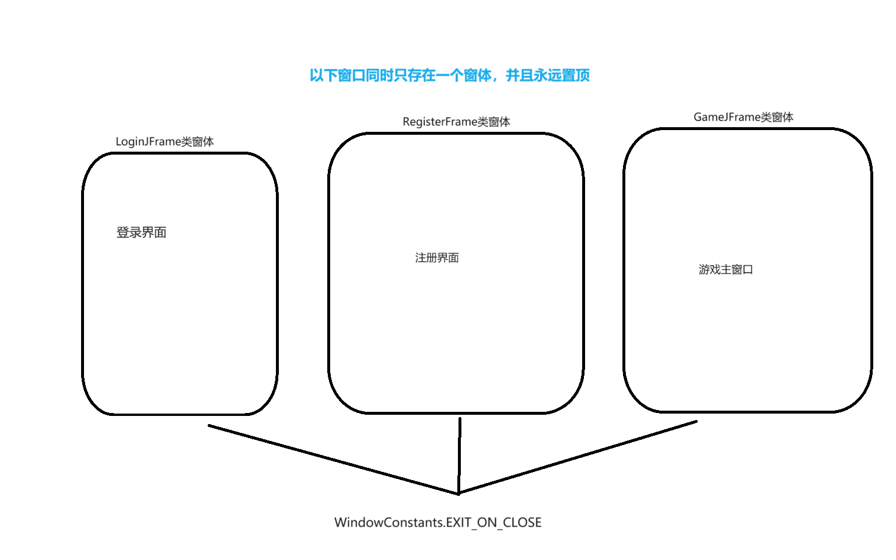

# Puzzle Game项目说明
## 项目类型
* 此项目类型为游戏项目，公开源代码，只是个练手项目。
## 项目结构

这张图是此项目的窗体结构图

### *窗口组成子类*
| 类名            | 功能         | 组别      |
|---------------|------------|---------|
| LoginJFrame   | 验证用户后进入组别2 | 组别1 主程序 |
| RegisterFrame | 建立并写入新用户类  | 组别1     |
| GameJFrame    | 游戏主程序窗口    | 组别2     |

### 图片要求
**完整图片为420*420，文件格式要求为JPG**
## 技术分析
### 实现依赖
* 此项目的制作过程依赖于Java Swing的JFrame类
* 图片素材来源于网络
* 使用PS对素材进行切片
